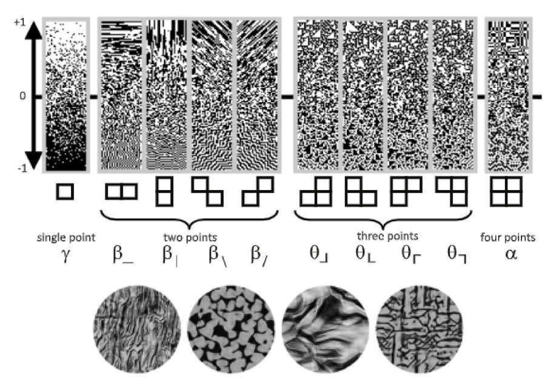
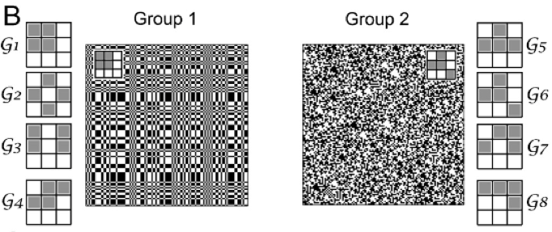
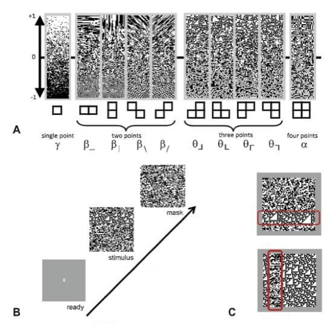
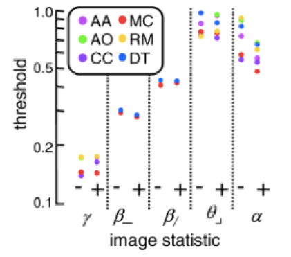
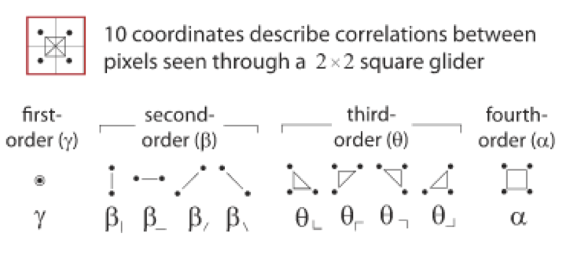
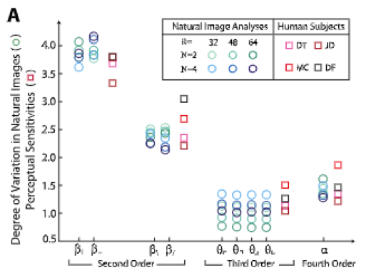
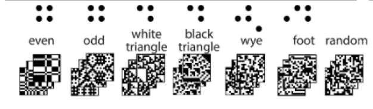
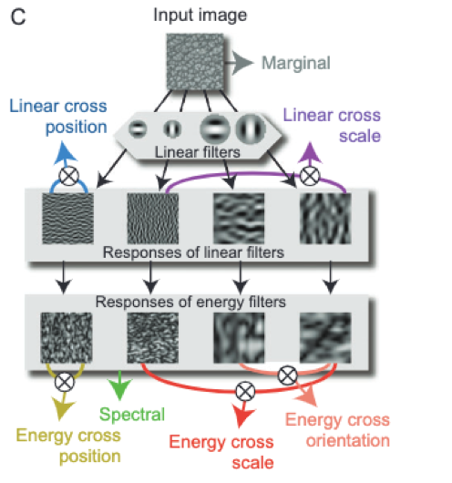
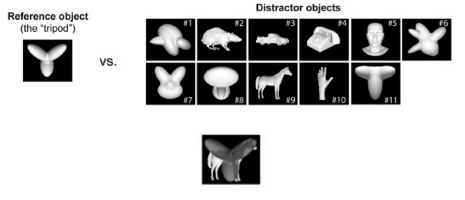
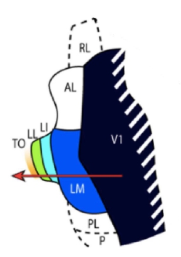

---
output:
  bookdown::word_document2: default
  bookdown::pdf_document2:
    template: ../templates/brief_template.tex
  bookdown::html_document2: default
documentclass: book
bibliography: references/refs.bib
---

```{r echo=FALSE}
library(knitr)
```

```{block type='savequote', quote_author='(ref:attneave-1954-some)', include=knitr::is_latex_output()}
The human brain could not possibly utilize all the information provided by states of stimulation that were not redundant.
```
(ref:attneave-1954-some) --- Fred @attneave-1954-some, *Some informational aspects of visual perception*

<!-- Needed for leaving space to the quote, * is for no indentation after title -->

\titlespacing*{\chapter}{0pt}{80px}{35pt}

# **Introduction** {#chap:intro}
\minitoc  <!--this will include a mini table of contents-->

\chaptermark{Introduction}

## Complex nature of visual input {#subchap:complex}

Vision allows for perception of dynamic objects in a constantly changing environment. However, natural objects themselves do not change randomly over time. Instead, image points at nearby locations are highly correlated. For example, object luminance in closeby points changes gradually over space and time, and only at the edges the luminance may change abruptly. Still, not all correlations are informative for the brain - some are redundant [@Field-1987], and the brain has to be able to distinguish between the informative and non-informative ones.  Furthermore, the brain has to use these regularities to efficiently process the visual information [@Dong1995-ds].

\vspace{5mm}

But why does the brain need to exploit such correlations in its visual inputs? This is due to the fact that natural scenes contain an amount of information vastly superior to the computational power of the brain (for example, the optic nerve has a limited transmission capacity [@Van_Essen1991-aq]) [@Sziklai1957-yg]. The complexity of natural stimuli and the limited resources of the brain led to the formulation of the **efficient coding principle**. This idea, based on Shannon information theory [@shannon-1948-mathematical], was developed initially by @attneave-1954-some and @Barlow1961-kj. It claims that sensory systems process information in a way that reduces its redundancy while minimizing information loss. According to the efficient coding principle, the brain has evolved in order to extract the most relevant and informative data from the vastness of the sensory input [@Simoncelli2001-zm]. How is it achieved? The ultimate goal is to allocate brain resources in the most efficient way given four parameters: the amount of input noise (noise coming from the environment along with the stimulus), the amount of output noise (noise in the signal transmitted between different ‘stations’ along the sensory pathway), the input signal variability, and the amount of resources available in the brain [@Hermundstad2014-gk]. The output noise and the constrained output capacity of the system together determine the bandwidth of the system - the expressive capacity of its outputs. In recent years, efficient coding has been used to explain important aspects of low-level vision: e.g. the increase of retinal ganglion receptive fields in dim light or changes in ocular dominance of V1 neurons in response to environmental conditions [@Zhaoping2006-xf].

## Efficient coding in the sensory periphery {#subchap:efficient-coding}

Efficient coding has been shown to explain many brain processes both in the periphery and at higher processing stages. In the periphery – in particular, at the level of the retina - the so called *whitening* process was found to be predicted by efficient coding [@Srinivasan1982-lr]. The optic nerve bandwidth limitations lead to a setting where output noise, introduced by the linear filtering happening at this stage, is far more problematic for efficient processing than the input noise of the signal coming from the photoreceptors. To efficiently process the information under this condition the brain needs to employ a strategy that exploits the statistical properties of natural images. As was mentioned earlier, neighboring pixels in the visual input are highly correlated, which means that any given value can be predicted from its surrounding values. Therefore, each value can be represented as the difference between a central pixel and its prediction from the linear sum of the surrounding pixels’ values. This manipulation decorrelates the image (or *whitens* it), removing output redundancy. The neuron will fire less if centre and surround are driven equally, which is the case with the stimuli of low spatial frequency simply due to their larger size [@Pitkow2012-pl]. Therefore, centre-surround receptive fields should reduce spatial correlations in the retinal output. To summarize, efficient coding theory assumptions at the periphery suggest that if variability of a certain feature of the input is high, the gain of neurons will be low and vice versa. This means that input signal will be ‘whitened’ by making variance equal in different neuronal populations coding for that input.

\vspace{5mm}

Several studies have been successful in explaining other aspects of peripheral processing using efficient coding theory. Efficient coding explains the centre-surround nature of LGN and retina receptive fields, as well as some interesting properties of their neurons - for example, neurons with extra-classical receptive field (RF) effects. Such neurons stop responding when their preferred stimulus is presented both inside and outside of the RF at the same time. @Rao1999-fj suggested that such neurons act as residual error detectors that signal the difference between the input value and its prediction from the surroundings. 

\vspace{5mm}

Interestingly, recent experimental studies show that efficient coding theory does not account for all decorrelations happening at the early steps of visual processing. @Pitkow2012-pl, for example, showed that linear filtering by the receptive field alone accounted for only a part of decorrelated input, and the rest was achieved by nonlinear operations in the retina (a steep response threshold). They also pointed out that the issue of redundancy is not that straightforward: it is not necessarily the case that less redundancy means more efficacy, and that decorrelation as a way to reduce redundancy is evidence of improved efficacy. 

\vspace{5mm}

We have just seen some examples of efficient coding theory ‘implementations’ in the brain at the early stages of visual processing. However, when moving to cortical areas, limitations of the input and output signals transmission become different - for instance, the optic nerve bottleneck is not a constraint anymore. In this new regime, what are the predictions of the efficient coding principle? Is the efficient coding principle still able to explain visual processing? 

## Efficient coding in the visual cortex {#subchap:complex}

Hermann von Helmholz, a German scientist who worked, among many other things, on visual perception, more than a century ago suggested that perceptual processes are inference-based and probabilistic in nature [@Von_Helmholtz1896-hi]. It means, essentially, that every bit of information extracted from the visual scene must have a certain probability of occurrence in different environmental settings, and thus, must be of different informativeness to the brain. The brain operates on these probabilities to build a visual representation of the world.

\vspace{5mm}

Earlier in this chapter visual processing at early stages was described. Since higher visual areas deal with more complex processing, integrating different features to create a full representation of the visual environment, they have to perform statistical inferences instead of immediate faithful encoding. This is where neural coding strategies and the properties of the natural environment come together. @Field-1987 posed an idea that images taken from the natural environment show a number of statistical properties, and there is a relationship between the distribution of these properties and the way the brain processes visual information. Indeed, it has been shown that brain sensitivity to some image statistical properties was rank-ordered in the same way as their variability in natural images; or, as nicely put by @Hermundstad2014-gk - *variance predicts salience*. If variance of a particular feature is high, this feature is less reliable or predictable - therefore, more resources will be allocated to the processing of this feature. This is a direct consequence of efficient coding: in the cortex where input noise is the main limiting factor (unlike the processing in the retina, where, instead, output noise limits transmission), the most efficient way to encode information is to invest more resources in the most variable features, as those are the ones that allow to better discriminate the elements of a noisy scene.

\vspace{5mm}

In the context of natural image properties and their relationship with the brain processing, it is necessary to discuss one of the most efficient ways this relationship can be studied - namely, through the use of *textures*.

## Textures as a proxy to natural images

Natural scenes are very complex, but, luckily for our brains, they also possess certain statistical regularities. Such regularities are termed *image statistics*. The brain uses image statistics to make inferences about the environment. The establishment of a precise relationship between statistics of natural images and neural processing is important. First of all, it provides an understanding of the functional properties of neurons and informs the creation of new, realistic and robust computational models. Such insights can also contribute to the creation of new, more ecologically valid (representative of the real-world environments) ways to study visual perception. Finally, gaining more understanding of how the brain processes image statistics might be relevant for the creation and enhancement of human-computer interfaces.

\vspace{5mm}

Making a reliable quantitative link between the properties of natural images and neural activity is not an easy task. One needs to develop a set of stimuli that would fit the purpose, given the complexity of natural scenes, and that would yield interpretable experimental results. One way to do that is to examine the properties of neural responses using natural images. This means using naturalistic stimuli (e.g. real life pictures of objects, scenes etc.) to probe neural activity. This approach provides significant ecological validity, as the results would be generalizable to the real-world environment. However, there is also a disadvantage: in natural images it is very difficult to control for all statistical relationships between pixels, which is of crucial when studying brain sensitivity to image statistics. The second approach is to use artificial stimuli - e.g. gratings or white noise. Such stimuli are built based on mathematical models, therefore, they are mathematically ‘convenient’. However, they rarely represent the kind of features that are present in real environments, therefore, increasing the chances of overlooking particular phenomena or building unrealistic models [@Victor2012-dk].

\vspace{5mm}

To overcome the disadvantages of both naturalistic and purely mathematically-convenient stimuli, **artificial textures** have been used in neuroscience research. Artificial textures are a class of visual stimuli that allows the precise control of specific image statistics and has specific local features repeated for their entire extension. Artificial textures are not defined as a single image but rather as an ensemble of images where each sample has to typify the entire collection. This criterion, on the one hand, replicates the property of natural material textures, where once one has seen a sample of a material, they are able to recognise any other instance of it. On the other hand, this distinguishes a texture from any other type of image (e.g. faces or landscapes): every single texture conveys properties of a larger set of images from which it was drawn. Therefore, a texture is not a specific image (although we can refer to it that way as well), but rather an ensemble of images that are all built according to the same criteria [@Victor2017-hm].

\vspace{5mm}

Here it deems necessary to clarify several concepts that will help understand the properties of textures. A _**statistic**_ is a mathematically-defined feature of an image (or better, a collection of images, since we are talking about textures), whose value is computed considering a particular image sample or pixel window. For example, luminance is an image statistic. The amount of data points used independently from the others to calculate a statistic defines the *order* of this statistic: for example, average luminance is a *first-order statistic*, because to compute it, we need to compute the value of each single pixel, and then take the average. Correlation, on the other hand, is a high-order statistic, because it is necessary to consider two or more data points to compute it. 

\vspace{5mm}

Computing any image statistic requires an averaging process. This can be done in two different ways: one can compute average over all points/windows in a texture, or one could compute average over all points at the same location in an ensemble of images. A key property of a texture is that these two averages should yield identical results. This mathematical property is called *ergodicity*. Another important characteristic of textures is *spatial homogeneity*: averages computed at specific locations over the ensemble of images match each other. Spatial homogeneity also implies that ensemble averages have to match between all the possible positions in an image. It means that textures are infinite in their spatial extension. Therefore, one can think of every particular texture stimulus as a sample taken from an endless 'canvas' that represents a texture.

\vspace{5mm}

Constructing a texture in a context of visual system probing is challenging. The main issue that is crucial for using textures as stimuli is to control for various interdependencies arising between different texture parameters. Several methods have been developed to overcome this problem - for example, restricting the range of spatial correlations [@Chubb2004-rc; @chubb2000variance], computer-graphic approaches [@xu2000chaos] or approaches modifying the frequency domain of an image. However, all these methods still have limitations related to inability to properly control one or several of the image parameters [@Victor2017-hm]. The limitations of the above approaches have led to the development of a second class of strategies to control image statistics of multiple orders and spatial scales. One of them is a subclass of textures called _**maximum entropy textures (MET)**_. MET are binary (black and white) textures that focus on local correlations between groups of up to four pixels. In these textures the value of one of the image statistics is predefined at a particular value, and the values of all other statistics are implicitly fixed based on the condition that the texture has to have *maximum entropy* – in other words, all image features need to be similar to white noise as much as possible except for the fixed statistic.

\vspace{5mm}

MET can be constructed using a process that depends only on the “parity count” of the number of pixels contained in the _**glider**_, which is the basic pixel block from which a texture is originated. Any specified statistic can take a value between -1 and 1. A value of 1 means that all the possible glider placements across the texture contain an even number of white pixels, a value of 0 means that the texture is pure white noise, while a value of -1 means that all glider placements contain an odd number of white pixels. Correlations in MET are defined based on the amount of points in the glider: $\gamma$ (gamma) is one-point correlation, $\beta$ (beta) is a two-point correlation, $\theta$ (theta) is a three-point correlation, and $\alpha$ (alpha) is a four-point correlation. For beta and theta statistics there are four ways to position the pixels in a glider, while for gamma and alpha statistics there is one way to do that. This gives rise to ten possible glider types. Figure 1 shows samples of MET for all the four   statistics, with the statistic level varying from -1 to 1, alongside with naturalistic textures to allow comparison. As can be seen from *Figure* \@ref(fig:MET), from a purely visual point of view, MET do not necessarily resemble a naturalistic texture that one could encounter in the real world.


```{r out.width = "100%", fig.align='center', fig.cap="(ref:METcapture)", label="MET", echo=FALSE}
 # Path to the figure
```
(ref:METcapture) *Top: Maximum entropy textures samples of the four types of multipoint correlations along with their corresponding subtypes. Y-axis represents correlation strength. Taken from @Victor2015-pw; Bottom: Some examples of naturalistic textures. Taken from @Ziemba2016-dl.*

\vspace{5mm}

MET are convenient for studying the response to high-order image statistics because they do not contain any undetectable correlations between statistics. However, the main limitation of MET is that they only allow the exploration of small spatial scales, while in natural images correlations on larger spatial scales (for example, correlations between groups of non-adjacent pixels or inside bigger gliders) may be relevant.

\vspace{5mm}

To summarize, textures are effective probes for analysing visual processing for several reasons. They allow to study a feature of interest in a controlled way while preserving the random nature of other features, therefore ‘taking the best from both worlds’ of visual stimuli. Furthermore, stimuli with a simpler structure, such as gratings or white noise, often do not elicit a response beyond initial stages of cortical processing. Textures, on the other hand, contain an abundance of features present in naturalistic images that elicit strong responses even at high cortical levels, while still allowing fine-tuning by the experimenter. Moreover, texture processing requires gathering and integrating information throughout space. This aspect is useful to study mechanisms of spatial vision. Finally, judgments based on textures require statistical inference, since the manipulation of image statistics is a central aspect of this kind of stimuli. Making statistical inferences is an essential part of visual processing, as relying just on the raw visual information itself is an ineffective strategy, and it is known that sensory systems make inferences based on different aspects of incoming information, as well as on pre-existing knowledge of the user.

\vspace{5mm}

Having an idea of the theoretical concepts behind texture stimuli, we can discuss, in the next chapter, human sensitivity to image statistics and how textures can be used to study it.

## Human sensitivity to image statistics

This chapter aims at providing a brief overview of experimental studies that probed human visual system sensitivity to image statistics using textures. 

\vspace{5mm}

A fundamental claim of the efficient coding theory is that human sensitivity to image statistics follows the variability of these statistics in natural environments. Indeed, it has been experimentally shown that many aspects of early visual processing are shaped by the necessity of perceiving natural stimuli in an efficient way that reflects their properties. For example, center-surround receptive field of retinal ganglion cells [@Dan1996-aj], mentioned above, cone spectral sensitivities and color opponency in ganglion cells [@Lee2002-al], overlaps of ganglion cell receptive fields, which balance redundancy reduction against signal-to-noise ratio improvement [@Balasubramanian2009-ab]. All these cases illustrate the efficient coding principle in the retina: systems invest more resources in features that would give maximum information gain.

\vspace{5mm}

Shifting the focus from the retina to more advanced processing levels, several studies have attempted to provide empirical evidence of the efficient coding principle at later stages of the visual processing, where nonlinear feature extraction occurs. The first fundamental step to validate the role of efficient coding at the cortical stages of visual processing is to understand the statistical properties of natural images. In the visual cortex, according to the efficient coding principle, we would expect to find an adaptation to these image properties in the processing of visual stimuli. @Tkacik2010-td identified statistical regularities of natural images and divided them into predictable (and therefore, according to the efficient coding principle, uninformative) and unpredictable (informative). They analyzed a set of grayscale natural images in the following way: first, they built intensity histograms, or distributions, of local pixel intensities, which showed that nearby pixels tend to have similar intensities for small patches, and, instead, at bigger patches they tend towards statistical independence. Second, the authors performed principal component analysis (PCA) to characterize the variations between the distributions. They found that approximately 90% of the variance was explained by three PCA components: mean, variance and fraction of dark pixels. Linear combination of these components represents the blackshot mechanism, which is believed to be present in the visual system to sense fine varying concentrations of dark pixels irrespective of the overall luminance of the background [@Chubb2004-rc]. 

\vspace{5mm}

One further step from the determination of perceptually significant image statistics is to understand what role high-order image statistics play in the results of @Tkacik2010-td. The authors repeated their analysis on a synthetic images ensemble that matched natural images in the power spectrum but not in other respects. The ensemble required just two principal components - mean and variance - to explain more than 90% of variation in the local intensity histogram. Moreover, the third component, the fraction of dark pixels skewed towards dark intensities, which was present in natural images, was absent here. This suggests that higher-order correlations, that are essentially the basis of the third component that together with mean and variance supports the blackshot mechanism in natural scenes, play a key role in making blackshot perceptually salient. 

Now that we established that some high-order correlations are perceptually salient, the next important step is to characterize these correlations: which of the high-order correlations are perceptually salient and what are their properties? This is a challenging question because the number of cross-correlations between pixels grows rapidly with the number of pixels. Moreover, lower-order correlations induce high-order correlations, which makes it difficult to find intrinsically high-order correlations. It has been shown before by @Victor1991-ds that some textures seem to have perceptually salient features, while other do not. @Tkacik2010-td conducted a further analysis of texture structure to understand why this was the case – in other words, why the human visual system is sensitive to one kind of textures but not the other. They used eight kinds of four-pixel gliders that contained fourth-order, but no second- or third-order correlations to generate a set of textures. The generated textures were divided two groups (*Figure* \@ref(fig:TextureGliders)). Textures in Group 1 were perceptually salient, based on the previous experimental study, and those in Group 2 were not salient. 
\vspace{5mm}

```{r out.width = "100%", fig.align='center', fig.cap="(ref:TextureGliders-capture)", label="TextureGliders", echo=FALSE}
 # Path to the figure
```
(ref:TextureGliders-capture) *Two groups of textures based on the gliders (G1-G8) used to create them. Taken from @Tkacik2010-td.*


What made Group 1 correlations to be salient? Tkacik and colleagues performed an additional analysis and showed that the fourth-order correlations in natural scenes are much more informative when measured in the pixel arrangement of the gliders G1-G4 (*Figure* \@ref(fig:TextureGliders)), which are exactly the gliders that make perceptually salient textures. The findings of @Tkacik2010-td confirmed at a more theoretical level the experimental results shown in @Victor1991-ds that demonstrated how different types of textures elicited different sensitivity.

To summarize, higher-order correlations that are obtained from the gliders that represent pixel arrangements common in natural pictures, have been shown to be salient for the human visual system. However, to establish a reliable relationship between image statistics and human sensitivity, experimental studies are needed.

@Victor2012-dk provided an initial account of human sensitivity to image statistics of different order using MET. The subjects were instructed to complete a forced-choice segmentation task: identify the position of the target laid over a background (*Figure* \@ref(fig:TextureVictor)). The target was distinguished from the remainder of the array by its statistics.

```{r out.width = "80%", fig.align='center', fig.cap="(ref:TextureVictor-capture)", label="TextureVictor", echo=FALSE}
 # Path to the figure
```
(ref:TextureVictor-capture) *Examples of textures and a presentation pipeline used in @Victor2012-dk. Taken from @Victor2012-dk.*


@Victor2012-dk demonstrated that, compared to noise, human sensitivity to multipoint correlations is rank-ordered in a particular way: namely, humans are more sensitive to first-order correlations (gamma), followed by second- (beta), fourth – (alpha) and third-order (theta) correlations (*Figure* \@ref(fig:HumanSens)).

```{r out.width = "60%", fig.align='center', fig.cap="(ref:HumanSens-capture)", label="HumanSens", echo=FALSE}
 # Path to the figure
```
(ref:HumanSens-capture) *Human sensitivity to 1- to 4-point correlations obtained by Victor and Conte (2012). Colored dots indicate subjects. Taken from @Victor2012-dk.*

\vspace{5mm}

Adding further evidence to this line of research, the work of @Hermundstad2014-gk put together the findings obtained by @Tkacik2010-td and @Victor2012-dk, confirming the experimental results regarding human sensitivity to image statistics. Hermundstad and colleagues selected informative correlations and investigated how resourses were allocated to the different statistics within this informative feature space. First, they performed the analysis of natural images to define a set of image statistics present in them, focusing on a 2×2 square glider. Ten unique combinations were found to describe correlations present in such a glider  (*Figure* \@ref(fig:Hermunstad)). These ten combinations corresponded to ten image statistics: one first-order statistic (the average luminance), four second-order statistics (pairwise correlations of vertically, horizontally or diagonally positioned pixels), four third-order statistics (correlations between three points in the glider) and one fourth-order statistic (correlation between all four points in the glider). The authors found that degree of variation of these statistics was rank-ordered: the most variable correlations are pairwise (beta) correlations in the cardinal directions, followed by pairwise correlations in the oblique directions, followed by fourth-order correlations (alpha) and, finally, by third-order correlations (theta). Importantly, such variance ranking was not found in white noise textures, demonstrating that this ranking is a feature of natural images only.


```{r out.width = "80%", fig.align='center', fig.cap="(ref:Hermunstad-capture)", label="Hermunstad", echo=FALSE}
 # Path to the figure
```
(ref:Hermunstad-capture) *Ten image statistics identified in natural images by @Hermundstad2014-gk. Taken from @Hermundstad2014-gk.*


\vspace{5mm}

Next, Hermundstad and colleagues conducted an experiment to investigate human sensitivity to the abovementioned image statistics. The experiment was based on the setup of one of the previous studies of the group, @Victor2012-dk. Hermundstad and colleagues overlaid a target texture on a background and instructed participants to determine the location of the target texture. To ensure that the response was elicited by figure/background segmentation, two kinds of stimuli were used: 1) the target had a nonzero value of a statistic, and the background had a random distribution of black and white pixels (white noise); 2) the target was random and the background had a nonzero value of a statistic. The results showed that _**humans are sensitive to these statistics in the same rank-order as their variance**_, supporting the efficient coding hypothesis (*Figure* \@ref(fig:Hermunstad2)). @Victor2015-pw performed an analogous experiment and confirmed the results regarding sensitivity to multipoint correlations that were obtained by @Hermundstad2014-gk.

```{r out.width = "60%", fig.align='center', fig.cap="(ref:Hermunstad2-capture)", label="Hermunstad2", echo=FALSE}
 # Path to the figure
```
(ref:Hermunstad2-capture) *Degree of variation in different statistics of natural images (circles) and human sensitivity to these statistics (squares). R denotes the patch size and N denotes the block-average factor used during image preprocessing. Taken from @Hermundstad2014-gk.*

\vspace{5mm}

@Hermundstad2014-gk also proposed a model of central visual processing that links the efficient coding principle to the correspondence between the rank-order of image statistics and human sensitivity. In other words, they demonstrated that visual sensitivity for local multi-point spatial correlations can be predicted from the structure of natural images. This suggests that efficient coding extends to higher-order sensory features and operates in a regime in which sensitivity increases with feature variability.

\vspace{5mm}

Another recent study by @Tesileanu2020-uf also supports the efficient coding principle experimentally. The authors used grayscale textures instead of black and white ones. The task was to find a target texture within a background.Both the background and the target texture were obtained using three grayscale levels. Target and background were distinguished by the texture used to color the checks: one was always an independent identically-distributed (IID) texture with three gray levels (the analogue of white noise in the binary case); the other is a texture specified by one or two of the image statistics described before. Textures in this second group are maximum entropy. Tesileanu and colleagues demonstrated that subjects’ sensitivity to image statistics corresponded to their variance in natural images expanding the findings presented in  @Hermundstad2014-gk to the space of non-binary images. Moreover, the authors found two other interesting properties of human sensitivity to image statistics that further support the efficient coding theory. First, perceptual thresholds do not change if the texture is flipped symmetrically - even if the texture is not symmetrical visually. This suggests that this invariance arises from the statistics distribution itself rather that from the visual resemblance of symmetry. Tesileanu and colleagues suggested that this feature reflects the visual system adaptation to the symmetries in the real world.  Second, the authors found bright-dark asymmetries in perceptual thresholds for statistic detection – namely, a threshold in a setting in which there are more dark pixels than light ones is lower than in the opposite case. It has been indeed shown before (e.g. @Chubb2004-rc, reviewed above) that natural images have an asymmetry between bright and dark contrasts, and the visual system is tuned to this property. 

\vspace{5mm}

To sum up, previous studies in humans showed that human sensitivity to image statistics is tuned to their variability in natural scenes, and textures represent the class of stimuli that can be effectively used to probe this sensitivity. However, to further advance in understanding this aspect of visual perception, insights into the neural correlates of such sensitivity are required. 

## Neural basis of multipoint correlations perception

Animal models offer a valuable opportunity to gain insight into neural underpinnings of sensitivity to image statistics, since such kind of research requires invasive methods with high spatial and temporal resolution.

\vspace{5mm}

Monkey is the most commonly used model to probe different aspects of visual perception. One of the first studies conducted in monkeys to demonstrate that the efficient coding principle has a neural basis in the visual cortex was the work of @Yu2015-cp. Based on the result of @Hermundstad2014-gk, authors used single-unit recordings in macaque V1 and V2 areas of the visual cortex to determine where sensitivity to different multipoint correlations arises. The stimuli were 1) random noise textures; 2) six structured sets of stimuli (*Figure* \@ref(fig:YuStim)): the ‘even’ and ‘odd’ sets isolate the opposite extremes of the visually salient four-point correlation ($\alpha$, alpha). The ‘white triangle’ and ‘black triangle’ sets isolate the extremes of the visually salient three-point correlation ($\theta$, theta). The ‘wye’ and ‘foot’ sets had multipoint correlations that are not visually salient [@Victor1991-ds] because they are predictable from lower-order correlations [@Tkacik2010-td]. Yu et al. found that in the supragranular layers of V2 neuronal sensitivity to salient three- and four-point correlations (as defined in @Victor1991-ds) was very pronounced, while V1 neurons virtually lack such sensitivity. 

```{r out.width = "80%", fig.align='center', fig.cap="(ref:YuStim-capture)", label="YuStim", echo=FALSE}
 # Path to the figure
```
(ref:YuStim-capture) *Image statistics (first row) and the corresponding textures used in the study by @Yu2015-cp (second row). Taken from @Yu2015-cp.*

\vspace{5mm}

The findings of @Yu2015-cp were supported by other studies that probed monkey visual cortex using texture-like stimuli. These stimuli differ from MET described in the current work in that higher-order image statistics they contain consist of various combinations of Gabor-like filter responces with different orientations and positions (*Figure* \@ref(fig:OkazavaModel)) instead of multipoint correlations directly obtained from pixel gliders. Nevertheless, they support the main claim of @Yu2015-cp: along the ventral stream there is an increase of selectivity for complex contours and higher-level features. An example of these are the studies that used naturalistic textures introduced in @portilla2000parametric to probe primates ventral stream, expanding the work done on humans (e.g. @Freeman2013-nt). @Ziemba2016-dl used naturalistic texture stimuli that exactly represent the statistics of a predefined texture (therefore, should be perceptually the same) but are markedly different in arrangement of their local features – in simple words, they seem visually different but are statistically the same. The authors recorded from the V1 and V2 neurons of anesthetized macaque monkeys.  They found that neurons in V2 are more tolerant and selective than V1 neurons for the higher-order image statistics.  Another work, conducted by @Okazawa2017-dj using naturalistic textures, compared responses of areas V2 and V4 to higher-order image statistics and showed that both V2 and V4 respond to higher-order statistics, but V4 demonstrated slightly stronger sensitivity to them. However, the relationship between sensitivity and visual hierarchy might be more complex: @Ziemba2019-ns conducted a study using multiunit recordings in monkey V1 and V2 areas. They found that sensitivity of V1 to image statistics seems to be higher than reported from the studies that used single unit recordings, although still less than in V2. The supragranular and infragranular layers of V1 were the ones that exhibited such sensitivity. Ziemba and colleagues suggest that this phenomenon is due to feedback from V2 to V1, because sensitivity to textures emerged first in V2, followed by the supragranular and infragranular layers of V1, and finally in the granular layers of V1.

```{r out.width = "50%", fig.align='center', fig.cap="(ref:OkazavaModel-capture)", label="OkazavaModel", echo=FALSE}
 # Path to the figure
```
(ref:OkazavaModel-capture) *A model describing the image features of naturalistic textures used in @Okazawa2017-dj. Taken from @Okazawa2017-dj*


\vspace{5mm}

However, the non-human primate model of the visual system, being one of the most used animal models, is not the only one. Since primates are evolutionarily related to humans, it was thought that they were the only model that has complexity of similar scale that the one of the human brain. Even though this claim is, in principle, true, using an animal model of exceptional complexity has its limitations: it restricts the amount of experimental approaches and increases the challenges in devising well-controlled experiments and interpreting the results. These constraints caused increased interest in using models that have been overlooked before due to their ‘simplicity’ - in particular, rodent models. Such models are less challenging to study, and, at the same time, they allow for the level of complexity that is suitable for probing the visual system. 

## Rodents as a model to study visual perception

Before addressing the studies that investigated image statistics perception in rat, , it is necessary to explain why rat can be a reliable and convenient model to study the visual system compared to the primate model, and it is also, then, important to have an overview of rat visual cortex from an anatomical and functional point of view.

\vspace{5mm}

Rats have proven themselves to be invaluable in studying visual system, as they offer a good tradeoff between complexity of the visual system and feature that can be studied. So, their visual system being less advanced than in monkeys offers the opportunity to probe fundamental features of visual perception while being able to perform well-controlled experiments and yield explicable results. Furthermore, new experimental tools, such as genetic and molecular manipulations or large-scale recordings from several visual areas at once are difficult or impossible to perform in monkeys. Experiments in rodents are also less labor-intensive and allow to obtain results from more subjects [@Zoccolan2009-nx]. Finally, and perhaps most importantly, it has been shown that rats can perform complex visual processing similar to primates. A bunch of studies has found that rats are capable of invariant object recognition, multifeatural integration of shape information and complex visual discrimination (e.g. @Zoccolan2009-nx; @zoccolan2015invariant). For example, in a recent study by @Djurdjevic2018-ge the authors trained a group of rats to discriminate a reference object overlapped by various distractor objects that had different levels of feature similarity to the reference (*Figure* \@ref(fig:Djurdjevic2018)). The aim was to establish a link between discrimination performance and compexity of perceptual strategy employed by the rats that were the most successful in the task. The results showed that rats employ subject-specific perceptual strategies that remain largely invariant across object transformations. Rats that performed with high accuracy used the higher variety of discriminative features in their strategies. Overall, these findings indicate that rats are capable of advanced processing of shape information, and, along with other studies on this matter [@Zoccolan2009-nx; @Rosselli2015-aj), suggest that rodents are powerful models for research on visual perception and recognition as they are capable of efficiently process complex features of visual stimuli.


```{r out.width = "100%", fig.align='center', fig.cap="(ref:Djurdjevic2018-capture)", label="Djurdjevic2018", echo=FALSE}
 # Path to the figure
```
(ref:Djurdjevic2018-capture) *Top: Stimuli employed in the task of @Djurdjevic2018-ge; Bottom: An example of a reference-distractor overlap. Taken from @Djurdjevic2018-ge.*

\vspace{5mm}

Understanding the neural underpinnings of visual processing in rats requires a brief overview of the rat visual cortex organization. The main visual areas that make up the visual system in rats include area V1, the lateromedial area (area LM), the laterointermediate area (area LI), the laterolateral area (area LL), and the occipitotemporal cortex (area TO). The primary visual cortex (V1; *Figure* \@ref(fig:RatCortex)) is the largest and most well-studied cortical visual area in rodents, including rats. Information from the retina reaches area V1, located in the occipital cortex, via the dorsolateral geniculate nucleus (dLGN) of the thalamus (a feature typical to all mammalian visual systems; @Glickfeld2014-yh; @seabrook2017architecture; @Briggs2017-ek). Neurons in V1 have diverse response properties that take a leading role in image, orientation, and motion discrimination tasks [@Petruno2013-nw]. They have orientation selectivity, some degree of direction selectivity, complex contrast sensitivity and diverse receptive field organization [@Girman1999-kn].

```{r out.width = "50%", fig.align='center', fig.cap="(ref:RatCortex-capture)", label="RatCortex", echo=FALSE}
 # Path to the figure
```
(ref:RatCortex-capture) *Anatomical position of the five main visual areas in rats, marked in color. Taken from @Vermaercke2015-sg.*

\vspace{5mm}

Areas LM, LL and TO have been shown to form a hierarchy that is believed to be analogous to the ventral stream – a pathway that carries information related to object recognition. Results from anatomical studies of rodent vision suggest the presence of a hierarchical architecture, similar to the ventral stream of the primate and human visual system that supports object discrimination and stimulus identity detection (@DSouza2020-kt; @Siegle2021-ry). Similiar claims also arised from several functional studies. @Vermaercke2014-qa conducted a series of experiments to uncover the hierarchy of the visual areas in rat visual cortex. They trained a number of rats to perform tasks involving orientation and direction tuning, shape processing, as well as basic position detection task, and recorded activity of the five visual areas. They found an increase in evoked response latency and receptive field size across levels of the visual hierarchy. Orientation and direction selectivity increased gradually from V1 to TO, as well as position tolerance. A further study by @Vermaercke2015-sg expanded the results of the beforementioned study. Using a similar shape discrimination task with extracellular single-unit recordings in naïve rats the authors showed that shape selectivity in extrastriate areas of the rat visual cortex, similarly to primates [@DiCarlo2012-in], is more strongly correlated with behavioral performance rather than with physical properties of the stimulus, suggesting that visual information is transformed from representing simple visual features to a representation that drives behavior. 

\vspace{5mm}

A study by @Tafazoli2017-yn investigated how visual information is processed along the hierarchy of extrastriate areas of the rat visual cortex – namely, LM, LI and LL, as well as in V1. They recorded from the abovementioned areas while passively presenting the animals with a set of different natural visual objects. The authors further confirmed the existence of the stream-like information flow throughout the visual areas. More specifically, they found gradually decreasing influence of low-level visual information, an increase in transformation tolerance and in the view-invariant object information conveyed by the neurons. These results are consistent with the idea of a feed-forward object processing hierarchy. The tuning properties of LI and LL were found to be similar to higher areas of the monkey ventral stream [@Rust2010-uf] – however, without enough evidence to equate the functions of the rat and monkey visual areas. The claim of @Tafazoli2017-yn that invariant object representations emerge along the rat ventral pathway was supported in a recent study by @Piasini2021-kc. The authors suggested that it is necessary to test the invariance assumption under more naturalistic viewing conditions. They presented a bunch of rats with natural movies that lasted several seconds while recording from the V1, LM, LI and LL areas. The authors showed that deeper brain areas encoded visual information more persistently – in other words, that they maintained their tuning for visual objects despite the changes in position and orientation.

\vspace{5mm}

To add to the evidence on the existence of the ventral stream hierarchy in rats provided by @Tafazoli2017-yn, @Matteucci2019-xt aimed to define the computations that underlie the ventral stream specialization for coding object identity. They presented a group of rats with drifting gratings and noise movies while recording from V1 and LL areas of the visual cortex. The authors discovered that along the progression from V1 to LL sensitivity to the phase of the grating decreases, meaning that neurons in LL are likely to be position-tolerant, whereas orientation tuning increased but became less sharp. These findings are consistent with the nonlinear summation of inputs that is expected to take place in the ventral stream, as predicted by results obtained from primates, also suggesting a significant level of similarity between rodent and primate visual hierarchy.

\vspace{5mm}

Considering rodent models as viable option to investigate visual system properties, it is important to determine what is the neural basis of higher-level visual abilities that rodents seem to posess. @Vinken2016-bh conducted a study to investigate the neural basis of object vision – one of the higher visual abilities inherent to primates. They presented a group of rats with natural movies featuring a rat or another object, as well as their phase-scrambled versions while recording from three target areas: V1, LI and TO. The results showed increased dissociation in representations of natural versus scrambled stimuli along the ventral stream. However, there was no clear category preference in the higher visual areas. Finally, along the cortical hierarchy the neural response seemed to be increasingly driven by more complex features rather than those represented in V1 and destroyed by phase-scrambling. However, there was no evidence for category selectivity for the rat versus non-rat distinction. The results of this study suggest that there is a functional hierarchy present in the rat visual cortex. Importantly, this hierarchy might not reach the same level of object selectivity as present in monkeys and humans.

\vspace{5mm}

In another study by the same group, @Vinken2017-zh looked at a different higher-level property of the mammalian visual system was investigated –the ability to detect fast changes in the environment and adapt to them. The authors recorded from areas V1 and LI of the rat visual cortex when rats were presented with an oddball paradigm, where a series of repetitive stimuli is periodically interrupted by a surprise stimulus. They observed response suppression for repetitive stimuli in V1 but no response enhancement for surprise stimuli. On the contrary, in LI both surprise-based response enhancement and stimulus-specific adaptation were present. These results suggest that neural responses along the rat ventral visual stream become increasingly sensitive to changes in the visual environment, probably reflecting a system specialized in the detection of unexpected events specific to rats, since such property has not been observed in primate studies that used the oddball paradigm.

\vspace{5mm}

However, despite many similarities in the anatomical and functional organization between rodent and primate visual cortex, there are some striking differences. For example, in rodents, V1 projects to motor, as well as limbic and somatosensory cortical regions [@Wang2007-kc]. This contrasts with the primate cortex, where such connections either do not exist or only higher visual areas project to non-visual cortical areas [@Felleman1991-it]. Primate and rodent visual cortices also differ in that the rodent visual system’s hierarchy is shallower (@Wang2012-oe; @DSouza2020-kt), which might explain why neurons in the rodent primary visual cortex are selective for more complex features, such as motion and orientation, and have position tolerance much higher than expected from V1, while such selectivity and tolerance arises only in higher level visual areas in primate (@Vermaercke2014-qa; @Palagina2017-jx; @Marques2018-bq). Moreover, it has been found that even in the putative higher visual areas in rats complex stimuli are not as strongly preferred as in the higher visual areas of the primate visual cortex. Also, the “dorsal-ventral stream” segregation in rats might be less evident than in primates (@@Vermaercke2014-qa).

\vspace{5mm}

Overall, the mismatches between primates and rodents show that these species might, to some extent, differ in visual system organisation and function. However, the number of similarities between them suggests that the insights from the visual system of rodents would still allow neuroscientists to gain a greater understanding of how the visual system processes information. 

## Perception of higher-order correlations in rats

As we have seen in the previous chapters, rats have proved themselves to be a viable model for studying the visual system properties. Discussing the main topic of the current thesis – the processing of higher-order image statistics - requires understanding of why it is feasible to believe that rats must be able to capture these statistics at all.

\vspace{5mm}

Research shows that rats are able to process first-order statistics – for example, luminance (@Minini2006-xw; @zoccolan2015invariant) and energy spectrum. At the same time, as described before, rats are also able to perform complex visual tasks such as shape discrimination, change detection, invariant object recognition, similarly to primates. These findings suggest that rats might be able to process higher-order image statistics.

\vspace{5mm}

A recent work by @Caramellino2021-pe is the first evidence to demonstrate that rats are indeed sensitive to multipoint image statistics. The stimuli employed in the study (*Figure* \@ref(fig:RiccardoBehav), *left*) were maximum entropy textures: textures that have a desired probability of occurrence of a predefined statistic while containing the most random structure possible for all other features. The statistics that were fixed were 1-, 2, 3-, and 4-point correlations.

```{r out.width = "100%", fig.align='center', fig.cap="(ref:RiccardoBehav-capture)", label="RiccardoBehav", echo=FALSE}
include_graphics('figures/Figure_11.png') # Path to the figure
```
(ref:RiccardoBehav-capture) *Example of stimuli used by @Caramellino2021-pe (left) and rat sensitivity to texture statistics (right). Filled dots indicate individual rat estimates. Empty diamonds show group averages. The dashed line emphasizes the sensitivity ranking for the four statistics. Significance markers $\star$$\star$ and $\star$$\star$$\star$ indicate, respectively, p \< 0.01 and p \< 0.001 for a two-sample t-test with Holm-Bonferroni correction. Taken from @Caramellino2021-pe.*

\vspace{5mm}

The authors trained different groups of rats to discriminate between white noise and textures containing a nonzero level of a particular statistic. They found thatrats were able to discriminate between white noise and the image statistics. Second, rat sensitivity to these statistics was rank-ordered in the same way as the variation of these statistics in natural images (*Figure* \@ref(fig:RiccardoBehav), *right*) and human sensitivity to these statistics, confirming the results of @Hermundstad2014-gk.

## Goals of the current work

As previously mentioned, there is evidence that rats perceive multipoint image statistics in the same rank-order as their variance in natural images, and that this sensitivity is similar to that of humans. The behavioral experiment conducted by @Caramellino2021-pe, described above, aimed to measure rat sensitivity to local multipoint correlations in 1- to 4-points gliders. The results revealed a sharp decrease in sensitivity from 2- to 4-point correlations and a further decrease from 4- to 3-point correlations (*Figure* \@ref(fig:RiccardoBehav), *right*). This finding confirms the same trend observed in humans, as well as in the variability of these correlations in natural images [@Hermundstad2014-gk].

\vspace{5mm}

However, the precise neuronal mechanisms of such sensitivity in rats are unknown. In this work we aimed at covering this gap. Based on this result obtained in @Caramellino2021-pe, we investigated the neuronal substrate behind the processing of multipoint correlations in rat visual cortex. Single-neuron recordings in the macaque monkey showed that more complex correlations (3- and 4-point ones) can only be reliably distinguished from noise starting from V2 [@Yu2015-cp]). We aimed to test whether lower-order (1- and 2-order) statistics can be discriminated from noise by the neurons in the primary visual cortex (V1), while 3- and 4-point statistics can only be discriminated in higher visual areas (LL). 

\vspace{5mm}

To test this hypothesis, we performed extracellular recordings on anaesthetized rats in V1 and the extrastriate area LL, that is considered the end point of rodent ventral stream. Animals were presented with textures containing all the statistics already investigated in the behavioral study of @Caramellino2021-pe, with varying levels of intensity. Our goal was to uncover, by performing acute recordings in areas V1 and LL of anesthesized rats, in which parts of the rat visual cortex sensitivity to each statistics arises. To do so we initially analyzed single neurons response characteristics and in particular their tuning for each statistic. Then we performed a decoding analysis where for each statistic we trained a classifier to use neuron populations response to discriminate between a single texture containing the statistic. Analysis of multiunit selectivity showed that V1 is selective to 1- and 2-point correlations, as expected based on previous research. Area LL was shown to be selective to 1-point correlations, similarly to V1, but selectivity to 2- and 4-point correlations was unexpectedly low. No selectivity for 3-point correlations was observed. These results are only partially in line with our hypothesis that LL, being a higher visual area, should exhibit more sensitivity to higher-order image statistics.  


\titlespacing{\chapter}{0pt}{0pt}{35pt}

