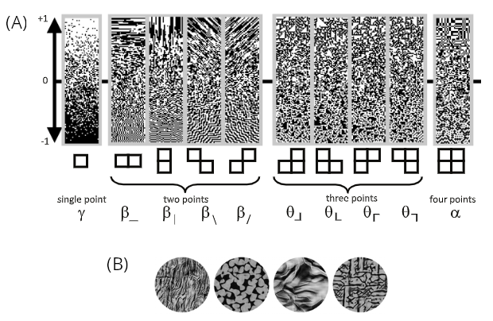

---
output:
  bookdown::word_document2: default
  bookdown::pdf_document2:
    template: ../templates/brief_template.tex
  bookdown::html_document2: default
documentclass: book
bibliography: references/refs.bib
---

```{r echo=FALSE}
library(knitr)
```

```{block type='savequote', quote_author='(ref:attneave-1954-some)', include=knitr::is_latex_output()}
The human brain could not possibly utilize all the information provided by states of stimulation that were not redundant.
```
(ref:attneave-1954-some) --- Fred @attneave-1954-some, *Some informational aspects of visual perception*

<!-- Needed for leaving space to the quote, * is for no indentation after title -->

\titlespacing*{\chapter}{0pt}{80px}{35pt}

# **Introduction** {#chap:intro}
\minitoc  <!--this will include a mini table of contents-->

\chaptermark{Introduction}

Lorem ipsum dolor sit amet, consectetur adipiscing elit. Quisque magna mi, pulvinar vitae mi vel, sagittis placerat ante. Sed in rutrum mauris. Quisque ultrices purus nec magna viverra posuere. Cras nec efficitur nibh, quis ultrices odio. Nunc neque lectus, tempor quis metus vel, ultrices fermentum massa. Duis sit amet condimentum ipsum, at mattis quam. Nunc quis turpis porta, malesuada massa nec, dapibus mauris. Nam volutpat ornare blandit. Quisque mattis tincidunt scelerisque. Nunc in pretium leo. Etiam venenatis nibh in arcu euismod feugiat.  

Vestibulum rutrum eu sapien a placerat. Fusce nec luctus magna. Vestibulum rhoncus erat a augue vestibulum molestie. Proin quam risus, mollis sit amet dolor vel, lobortis sollicitudin metus. Mauris eu ante sem. Aliquam cursus fermentum tellus vel accumsan. Aenean vehicula egestas ligula, a blandit felis dictum et. Integer sagittis, augue vitae convallis ornare, neque metus gravida diam, non auctor nisi dui et odio. Maecenas euismod lorem a neque varius, vel tincidunt eros aliquet. Aenean ultricies, sem aliquet condimentum scelerisque, purus elit euismod sem, vel rutrum purus mi in magna. **Get your attention with bold**: here we make *italics text*, and here a reference to next subchapter, Subchapter \@ref(subchap:complex).

## Complex nature of visual input {#subchap:complex}

Just write in markdown! 

If you want citations in text, like "and here's what was said by @shannon-1948-mathematical", use the at-sign without square brackets. The standard citations are instead done like this [@shannon-1948-mathematical]. The identifier you use should be the same at the beginning of one of the bibtex blocks in `references/references.bib`.

>This is a quote or an indented paragraph if you may need it :)

\noindent
The noindent here makes it prettier, but try to remove if you prefer to keep the indentation!

[Inline paragraphs]{.custompar} Using inline paragraph is super easy!

\vspace{-12pt}

[Another one]{.custompar} Here's another one! Notice the vspace helps in keeping things neatly spaced, but you can change it to your taste and recompile to try!

\vspace{10pt}

Now let's give a look at inserting a picture, notice how it always sticks to the top of the closest page.

(ref:textures-caption) This is your caption. Notice how the identifier is used below in fig.cap. Just include citations normally @shannon-1948-mathematical or \ref{fig:unique-label-textures} for refs.

```{r out.width = "100%", fig.align='center', fig.cap="(ref:textures-caption)", label="unique-label-textures", echo=FALSE}
 # Path to the figure
```

- Lists are great!

- Just do this. Want an underlined text? [Here you go]{.underline}

\begin{equation}
i < 3u \;\; \text{tesorina!}
\end{equation}

Multiline equations? Sure!

\begin{equation}
\begin{split}
I_{\mathrm{sequential}}(s) & = - \sum_{i=1}^m \log p(w_i \ | w_1, w_2, \dots, w_{i-1})\\
I_{\mathrm{bidirectional}}(s) & = - \sum_{i=1}^m \log p(w_i \ | w_1, \dots, w_{i-1}, w_{i+1}, \dots, w_m)
\end{split}
(\#eq:sent-surprisal-cases)
\end{equation}

That's about it!

\titlespacing{\chapter}{0pt}{0pt}{35pt}

