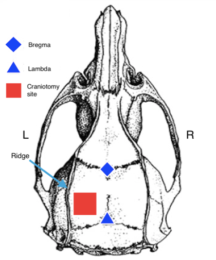
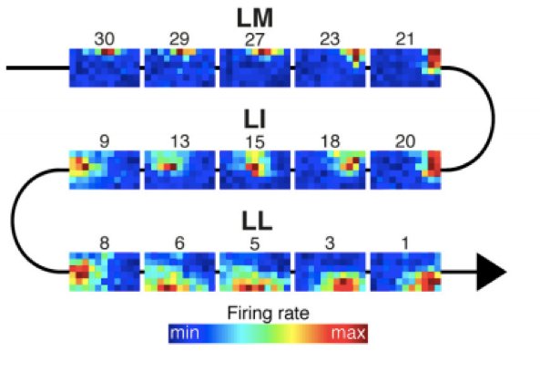
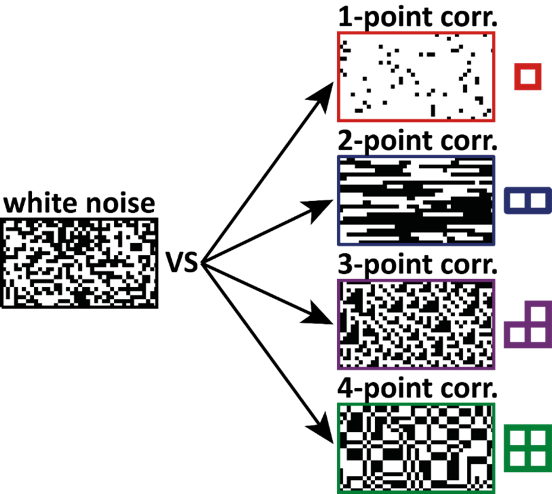
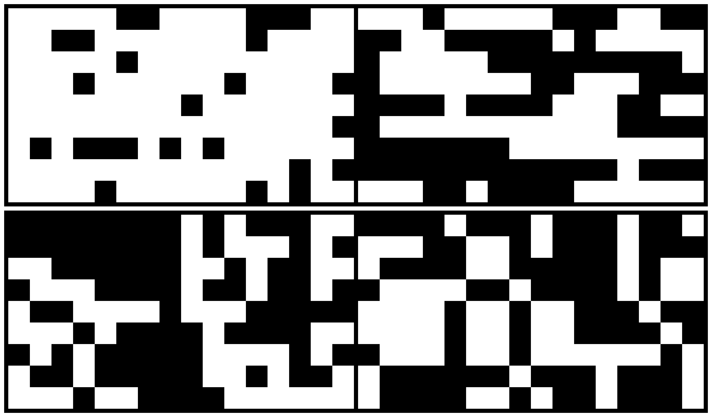
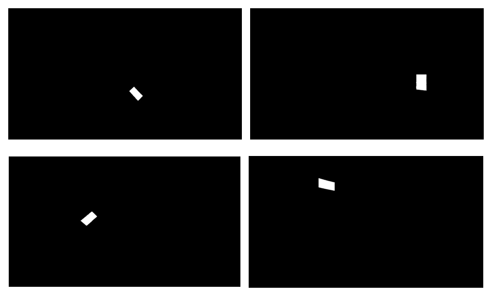

---
output:
  bookdown::pdf_document2:
    template: ../templates/brief_template.tex
    pandoc_args: [--wrap=none]
  bookdown::word_document2: default
  bookdown::html_document2: default
documentclass: book
bibliography: references/refs.bib
---

# **Materials and Methods** {#chap:materials-methods}

\minitoc <!-- this will include a mini table of contents-->

\chaptermark{Materials and Methods}

All animal procedures were in agreement with international and institutional standards for the care and use of animals in research and were approved by the Institutional Animal Care and Use Committee of the International School for Advanced Studies (SISSA) and by the Italian Ministry of Health.

## Neuronal recordings

The neuronal recordings were obtained from 6 Long-Evans male rats. This breed was chosen for its relatively higher visual acuity (1.0 cycles per degree) compared to the one of albino rats (0.5 cycles per degree) (Prusky et al., 2002). The animals were anesthetized with an intraperitoneal injection using a combination of fentanyl (0.3 mg/kg; Fentanest, Pfizer) and medetomidine hydrochloride (0.3 mg/kg; Domitor, Orion Pharma). A constant level of anesthesia was maintained through continuous intraperitoneal infusion of the same anaesthetic solution used for initial induction, but at a lower concentration (fentanyl (0.1 mg/kg per hour) and medetomidine (0.1 g/kg per hour)), by means of a syringe pump (NE-1000, New Era Pump Systems).

\vspace{5mm}

After anaesthesia the rat was placed in a stereotaxic apparatus (SR-5R, NARISHIGE) - a device used to precisely insert a recording electrode into a specific brain region, in flat-skull orientation (i.e., with the surface of the skull parallel to the base of the stereotax). At the beginning of each surgery, we performed a series of preparation steps including shaving the head of the rat and cutting off its whiskers and connecting the animal to the health monitoring equipment. After ensuring that the animal was properly anaesthetized by checking tail, ear and paw reflexes and counting the amount of breaths per minute while monitoring the heart rate, a scalp incision was made, and a craniotomy was performed over the left hemisphere. The precise position of the craniotomy was calculated using the stereotaxic apparatus to measure the bregma-lambda distance and the distance between the skull midline and the lateral ridge (*Figure* \@ref(fig:Craniotomy)). 

```{r out.width = "100%", fig.align='center', fig.cap="(ref:Craniotomy-capture)", label="Craniotomy", echo=FALSE}
 # Path to the figure
```
(ref:Craniotomy-capture) *A schematic representation of reference points and craniotomy site on rat skull. Adapted from @Han2012-hi*

The usual coordinates for the centre of the craniotomy when targeting V1 were 6.5 mm posterior from bregma and 3.5 mm left to the sagittal suture (i.e., anteroposterior, 6.5 mm; mediolateral, 3.5 mm), depending on the individual measurements of each rat. When targeting LL the centre of the craniotomy was placed at anteroposterior, 7 mm; mediolateral, 4.5 mm. Craniotomy dimension in both cases was 3x3 mm.

\vspace{5mm}

The dura was removed to allow the insertion of an electrode array. During the surgical procedure the level of anesthesia was periodically monitored by checking the absence of tail, ear and paw reflexes. The eyes were kept moist by using veterinarian eye drops (Epigel). Once the surgical procedure was completed, and before probe insertion, the stereotax was placed on a rotating platform, and the rat’s left eye was covered with black opaque tape, while the right eye (placed at 30-cm distance from the monitor) was immobilized using a metal eye-ring anchored to the stereotax. The platform was then rotated in such a way to bring the binocular visual field of the right eye to cover the left side of the display

\vspace{5mm}

Extracellular signals of neurons activity (spike trains) were recorded using two-shank 64-channels probes (Neuronexus A2x32-5mm-25-200-177-A64) in V1 and the extrastriate area LL. After grounding by wiring the probe to the animal’s head skin, the electrode was manually lowered into the cortical tissue using an oil hydraulic micromanipulator (typical insertion speed, 5 m/s; MO-10, NARISHIGE), up to the chosen insertion depth, either perpendicularly (for targeting V1) or with a 20° tilt (for targeting LL) relative to the vertical to the surface of the skull. Extracellular signals were acquired using a System 3 Workstation (Tucker Davis Technologies) with a sampling rate of 24.414 kHz.

\vspace{5mm}

At the beginning of each neural recording block, a receptive field mapping protocol was used to ensure that the neurons that were being recorded showed evoked activity, and to track the shape of the receptive fields and the progression of their position, needed to map the reversal of the retinotopy (only when recording in LL). This phenomenon consists of the sudden change in position of the receptive fields that, in rats, happens on the border between contiguous areas (*Figure* \@ref(fig:Progression)).

```{r out.width = "100%", fig.align='center', fig.cap="(ref:Progression-capture)", label="Progression", echo=FALSE}
 # Path to the figure
```
(ref:Progression-capture) *A receptive field progression along the hierarchy of rat extrastriate lateral areas from LM to LL. Taken from @Tafazoli2017-yn.*

If no evoked activity was detected after the insertion of the electrode, the probe was removed and we tried to perform a new recording from another available spot in the brain. If receptive field mapping protocol confirmed the presence of some evoked activity, the main protocol was initiated. After the end of the procedure the rat was euthanized using a combination of ketamine (Ketavet, 1ml/Kg), xylazine (Sedaxylan, 0.5ml/Kg) and acepromazine (Prequillan, 0.25ml/Kg).

## Visual stimuli

The stimuli set used in the current study consisted of 300 black-and-white maximum entropy textures (MET; 1920 × 1080 pixel image resolution), 15 white noise stimuli (1920 × 1080 pixel image resolution) and 40 sparse noise movies (288 frames each, single frame resolution 1920 × 1080 pixel). As described in Chapter 1, MET are textures in which a particular image statistic (multipoint correlations between up to 4 pixels in our experiment) is controlled while all other statistics are kept as random as possible to ensure maximum entropy. White noise textures were generated by sampling each pixel independently, with equal probability of each pixel to be black or white; therefore, they contained no spatial correlations. MET, on the other hand, were designed to enable precise control over the type and intensity of the correlations they contained. A software library *metex* [@Piasini2021-jn] that implements the method developed in @Victor2012-dk was used to build MET and white noise textures. The stimuli were analogous to those used in @Caramellino2021-pe. For any given type of multipoint correlation pattern the authors sampled from the distribution over binary textures that had the desired probability of occurrence of a statistic, but otherwise contained the least amount of structure (i.e., had maximum entropy). The probability of occurrence of the pattern was parametrized by the intensity (or level) of the statistic, determined by a parity count of white or black pixels inside tiles of 1, 2, 3 or 4 pixels (gliders) used as the building blocks of the texture. Four statistics – namely, 1-, 2-, 3- and 4-point correlations – were the target statistics in this study. Each statistic had five levels (0.2, 0.4, 0.6, 0.8 and 1), which correspond to the parity count of black and white pixels: for example, a level of 0.4 means that 40% of gliders that a texture was made from contain an even number of white pixels. When the intensity is zero, the texture does not contain any structure – it is the same as white noise (*Figure* \@ref(fig:TexExamples), *texture on the left*). When the intensity is +1, every possible placement of the glider across the texture contains an even number of white pixels. Intermediate intensity levels correspond to intermediate fractions of gliders containing the even parity count. The structure of the glider dictates the appearance of the final texture: a 1-point glider produces textures with different luminance biases; a 2-point glider produces oriented edges; a 3-point glider produces L-shape patterns; and a 4-point glider produces rectangular blocks (*Figure* \@ref(fig:TexExamples), *texture on the right*).

```{r out.width = "100%", fig.align='center', fig.cap="(ref:TexExamples-capture)", label="TexExamples", echo=FALSE}
 # Path to the figure
```
(ref:TexExamples-capture) *An overview of texture protocol structure: noise texture (left) and four examples of textures (right) corresponding to 1- to 4-point correlations, with the corresponding glider shown to the right of each texture. Taken from @Caramellino2021-pe.*

Each statistic level contained 15 texture instances, and each texture was presented 30 times during the protocol (trials). The amount of trials was determined on the basis of having enough data to draw reliable conclusions, because neuronal responses are not deterministic; in other words, even inside one class of stimuli the area is selective for not every stimulus might evoke a response, and not every response for different presentations of the same stimulus is exactly identical.

Each texture and each sparse noise stimulus contained 153 checks (dimensions: 17 × 9 checks). This number was chosen to ensure a balanced trade-off between the maximum number of checks in the texture and the rat ability to discriminate between the neighboring checks of opposite color given the reduced acuity of the rat visual system. *Figure* \@ref(fig:OurStim) shows four examples of the stimuli used in our experiment.

```{r out.width = "100%", fig.align='center', fig.cap="(ref:OurStim-capture)", label="OurStim", echo=FALSE}
 # Path to the figure
```
(ref:OurStim-capture) *Four examples of the stimuli used in our experiment. Top left: gamma statistic; Top right: beta statistic; Bottom left: theta statistic; Bottom right: alpha statistic. Statistic level = 0.6 for all of them.*

Sparse noise movies were stimuli that consisted of a quick alternation between black and white static squares in different positions of the screen on a gray background. Neuronal responses to sparse noise movies have not been analysed in the current work, but they will offer the possibility to discriminate between complex and simple cells in V1, because simple cells’  receptive fields should show a pattern of activity that differs in response to the black or white checks, while complex cells respond to a variety of stimuli across different locations.

\vspace{5mm}

Stimuli presentation was controlled through  MATLAB (MathWorks) using the Psychophysics Toolbox package and displayed with gamma correction on a 47-inch LCD monitor (SHARP PNE471R) with 1920 × 1080–pixel resolution, a maximum brightness of 220 cd/m2 , and spanning a visual angle of 110° azimuth and 60° elevation.


## Receptive field estimation

As mentioned above, before the main protocol a receptive field mapping protocol was run. Drifting bars with four different orientations placed in 70 positions of the screen were showed to the animal to obtain an approximate mapping of the receptive fields of the neurons recorded. *Figure* \@ref(fig:RFstim) shows four examples of the oriented bars used for receptive field mapping.

```{r out.width = "100%", fig.align='center', fig.cap="(ref:RFstim-capture)", label="RFstim", echo=FALSE}
 # Path to the figure
```
(ref:RFstim-capture) *Four examples of the oriented bars used for receptive field mapping.*

The protocol was run for an approximate duration of 10 minutes before constructing online the receptive field using OpenExplorer 2.31.0. This receptive field is obtained by computing the average number of spikes that were recorded for each of the screen positions covered by the bars.

## Data preprocessing

The neural data obtained from the recordings was preprocessed for further analysis. Spike times are extracted online through a threshold detection process based on the calculation of the deviation of the waveform, obtained from raw data applying a combination of high and low pass filters to its root mean square.Then the spike times were reorganized into a matrix and rescaled by and linked to the onset of the closest  stimulus. The factual onset of each stimulus was obtained during the neural recording using data collected by a photodiode positioned in a corner of the screen. 

\vspace{5mm}

Each electrode channel was considered a multiunit - the total spiking of small neuronal populations close to the channel. From the recorded neural activity, we then computed the window in which we considered the activity to be evoked by a stimulus using a dynamic spike count window process. A spike count window is a window that contains all the spikes that appeared in a certain range related to the onset of a stimulus. For each multiunit an individual spike count window was calculated using the process described in @Zoccolan2009-nx: spike times from each multiunit were discretized into time bins (range [-0.2, 0.55] ms with a step of 0.033 ms). Then, the time bin with the highest amount of spikes was selected and the time bins containing at least 70% of the largest time bin were identified. The start and end of the window was then set to include the bins that matched the abovementioned condition.

\vspace{5mm}

Since it is common for rats to have epileptic attacks during the presentations of long protocols of rapidly alternating stimuli and given that these crises lead to prolonged periods of cortical inactivity, we decided to exclude from the analysis the timespans that included and epileptic attack. The full recording was divided in 1-minute intervals and an interval was considered to contain an epileptic attack if neural activity remained below 50% of the average activity for more than 3 minutes. The end of the attack was positioned when activity went back to a level above 50% of the average activity. After checking that this criterion yielded correct windows across multiple recording sessions, these periods were excluded from the analysis.


\titlespacing{\chapter}{0pt}{0pt}{35pt}