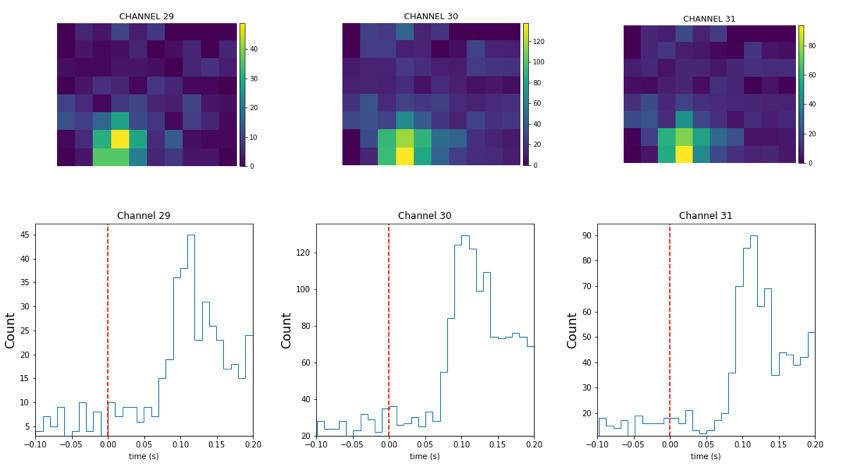
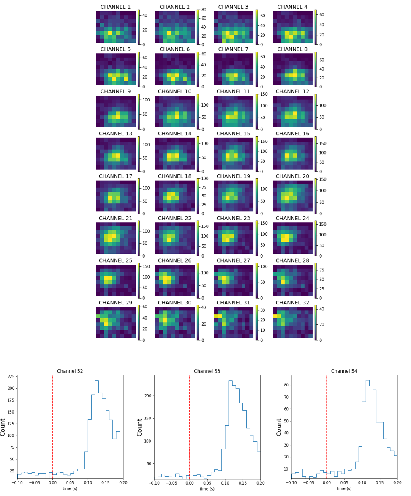
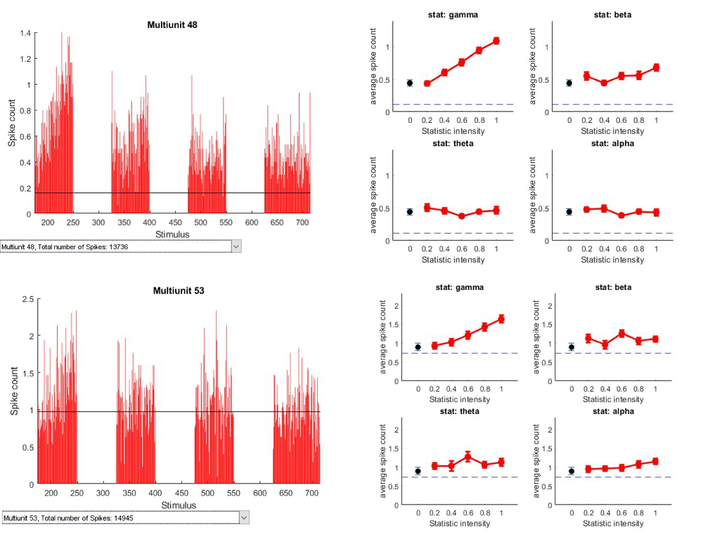

---
output:
  bookdown::pdf_document2:
    template: ../templates/brief_template.tex
  bookdown::word_document2: default
  bookdown::html_document2: default
documentclass: book
bibliography: references/refs.bib
---

# **Results** {#chap:results}
\minitoc <!-- this will include a mini table of contents-->

\chaptermark{Results}

## Initial considerations

Before proceeding to the results, it is important to note that neural activity analysed here is not guaranteed to have come from single neurons – in other words, each recording channel might not necessarily record activity of just one neuron, but a group of neurons. Therefore, we refer to neuronal populations in question as multiunits and assume that each electrode channel obtains activity of a multiunit. 

\vspace{5mm}

All data analyses were performed in Matlab, except for the receptive field mapping, which was done in Python. 

\vspace{5mm}

## Individual multiunit properties

As a first step, to define whether the recorded multiunits are responsive to visual stimuli, a receptive field mapping was always performed before the main protocol. *Figure* \@ref(fig:RFs) demonstrates the receptive fields of a subset of recorded multiunits in V1, along with the peristimulus time histogram (PSTH) that shows each multiunit's spike counts in a timespan around the presentation of a stimulus.

```{r out.width = "100%", fig.align='center', fig.cap="(ref:RFs-capture)", label="RFs", echo=FALSE}
 # Path to the figure
```
(ref:RFs-capture) *Top: Receptive field maps of three multiunits. The colors in each squared section of the colorbar correspond to the amoung of spikes that a particular multiunit produced for the stimulus shown in this section of the monitor. Bottom: PSTH of the presented multiunits. A red dashed line indicates the onset of a stumulus.*

Neurons in V1 are responsive to low-level visual properties, such as position and orientation. The yellow-colored portions of receptive fields observed for each multiunit, in principle, correspond to a screen position of a stimulus preferred by this multiunit. However, access to V1 is less challenging due to its anatomical position at the top of the ventral stream hierarchy. Therefore, the receptive field mapping in V1 acts mostly as a way to make sure the brain activity is evoked by the stimulus, and that the receptive field of the neurons in question indeed covers a part of the screen. On the contrary, when we move to a higher visual area, LL, looking at receptive fields is an important step to make sure that the electrode is (at least, in part) indeed located in the area LL. It is done by manually observing whether the movement of the receptive field progresses from the left to the right side of the screen (*Figure* \@ref(RFs_LL), top), which is a distinctive feature of LL receptive field (*Figure* \@ref(Progression)).

```{r out.width = "100%", fig.align='center', fig.cap="(ref:RFs_LL-capture)", label="RFs_LL", echo=FALSE}
 # Path to the figure
```
(ref:RFs_LL-capture) *Top: Receptive field maps of 32 multiunits comprising one whole electrode shank. The colors in each squared section of the colorbar correspond to the amoung of spikes that a particular multiunit produced for the stimulus shown in this section of the monitor. Bottom: PSTH of the three of the presented multiunits. A red dashed line indicates the onset of a stumulus.*

For each of the 6 recording sessions it was ensured that multiunit activity is evoked and that there is a clear receptive field pattern spanning a part of the monitor. The typical difference in size between V1 and lateral areas receptive fields (smaller for V1, larger for LL) and the difference in the response onset (<100ms for V1 and  >150ms for LL), combined with the manual check ensuring that the activity was evoked, act as a confirmation that we were indeed recording from different areas of rat visual pathway.

## Individual multiunit responses

We developed a simple graphic interface that allowed us to explore in detail the characteristics of the response of each of the recorded multiunit. Once a unit is selected the interface shows a global graph summarizing the neural responses for every stimulus (example in *Figure* \@ref(GlobalResp), V1 (top left) and LL (bottom left) and the tuning curve of the neuron for the different intensity levels of each statistic (example in Figure *Figure* \@ref(GlobalResp), V1 (top right) and LL (bottom right)).

```{r out.width = "100%", fig.align='center', fig.cap="(ref:GlobalResp-capture)", label="GlobalResp", echo=FALSE}
 # Path to the figure
```
(ref:GlobalResp-capture) *Left column: A global graph representing the activity of multiunits from V1 (top) and LL (bottom) for every stimulus. The X-axis denotes stimulus ID, the Y-axis – spike count (averaged across trials); Right column: A sample tuning curve of the neuron for the different intensity levels of each statistic.  The red line indicates a tuning curve, and the blue line – a linear approximation of the tuning curve to indicate a trend. A dashed blue line indicates background activity level.*

In the sample tuning curves above we could already observe a strong tendency for increasing selectivity to a gamma statistic for both V1 and LL multiunits.  

\vspace{5mm}

Selecting one of the columns corresponding to a stimulus in the global graph presented above  shows the multiunit activity for the texture that elicited that responce, along with the corresponding texture. In particular, for a specific stimulus we present both the raster plot showing the activity across trials and the psth obtained from the raster by binning the time window and averaging the number of spikes across trials that fall in each time bin. In Figure 19 we present an example for a V1 neuron (A, top) and an example  for an LL neuron (A, bottom) along with the corresponding stimuli that elicited the response (Figure 18B).
