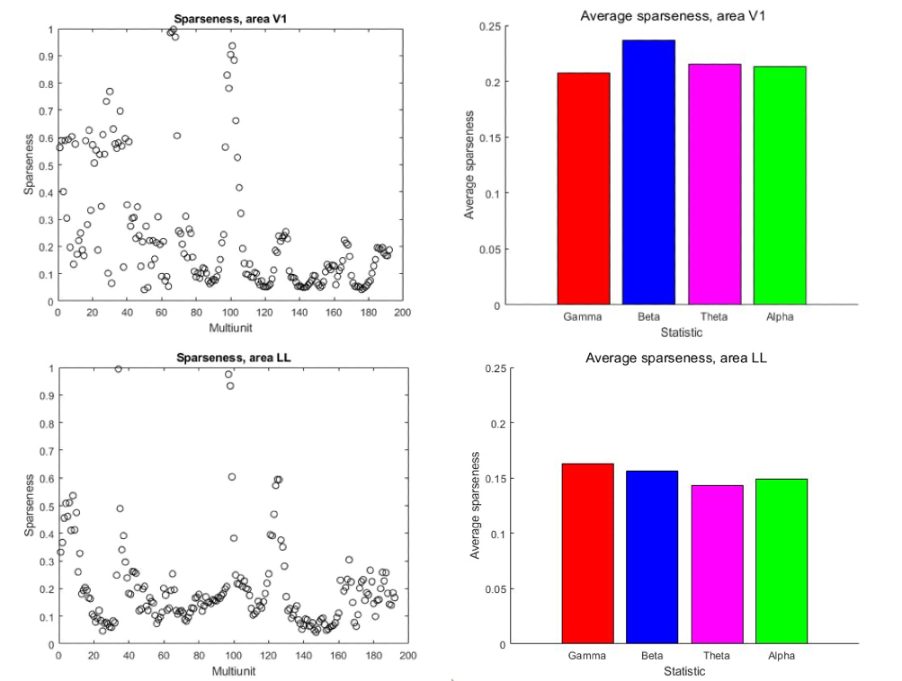
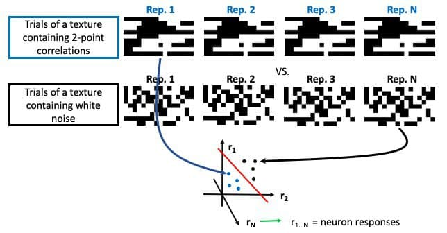

---
output:
  bookdown::pdf_document2:
    template: ../templates/brief_template.tex
  bookdown::word_document2: default
  bookdown::html_document2: default
documentclass: book
bibliography: references/refs.bib
---

# **Results** {#chap:results}
\minitoc <!-- this will include a mini table of contents-->

\chaptermark{Results}

## Initial considerations

Before proceeding to the results, it is important to note that neural activity analysed here is not guaranteed to have come from single neurons – in other words, each recording channel might not necessarily record activity of just one neuron, but a group of neurons. Therefore, we refer to neuronal populations in question as multiunits and assume that each electrode channel obtains activity of a multiunit. 

\vspace{5mm}

All data analyses were performed in Matlab, except for the receptive field mapping, which was done in Python. 

\vspace{5mm}

## Individual multiunit properties

As a first step, to define whether the recorded multiunits are responsive to visual stimuli, a receptive field mapping was always performed before the main protocol. *Figure* \@ref(fig:RFs) demonstrates the receptive fields of a subset of recorded multiunits in V1, along with the peristimulus time histogram (PSTH) that shows each multiunit's spike counts in a timespan around the presentation of a stimulus.

\vspace{5mm}

```{r out.width = "100%", fig.align='center', fig.cap="(ref:RFs-capture)", label="RFs", echo=FALSE}
include_graphics('figures/Figure_17.png') # Path to the figure
```
(ref:RFs-capture) *Top: Receptive field maps of three multiunits. The colors in each squared section of the colorbar correspond to the amoung of spikes that a particular multiunit produced for the stimulus shown in this section of the monitor. Bottom: PSTH of the presented multiunits. A red dashed line indicates the onset of a stumulus.*

Neurons in V1 are responsive to low-level visual properties, such as position and orientation. The yellow-colored portions of receptive fields observed for each multiunit, in principle, correspond to a screen position of a stimulus preferred by this multiunit. However, access to V1 is less challenging due to its anatomical position at the top of the ventral stream hierarchy. Therefore, the receptive field mapping in V1 acts mostly as a way to make sure the brain activity is evoked by the stimulus, and that the receptive field of the neurons in question indeed covers a part of the screen. On the contrary, when we move to a higher visual area, LL, looking at receptive fields is an important step to make sure that the electrode is (at least, in part) indeed located in the area LL. It is done by manually observing whether the movement of the receptive field progresses from the left to the right side of the screen (*Figure* \@ref(fig:RFsLL), *top*), which is a distinctive feature of LL receptive field (*Figure* \@ref(fig:Progression)).

\vspace{5mm}

```{r out.width = "100%", fig.align='center', fig.cap="(ref:RFsLL-capture)", label="RFsLL", echo=FALSE}
 # Path to the figure
```
(ref:RFsLL-capture) *Top: Receptive field maps of 32 multiunits comprising one whole electrode shank. The colors in each squared section of the colorbar correspond to the amoung of spikes that a particular multiunit produced for the stimulus shown in this section of the monitor. Bottom: PSTH of the three of the presented multiunits. A red dashed line indicates the onset of a stumulus.*

For each of the 6 recording sessions it was ensured that multiunit activity is evoked and that there is a clear receptive field pattern spanning a part of the monitor. The typical difference in size between V1 and lateral areas receptive fields (smaller for V1, larger for LL) and the difference in the response onset (<100ms for V1 and  >150ms for LL), combined with the manual check ensuring that the activity was evoked, act as a confirmation that we were indeed recording from different areas of rat visual pathway.

## Individual multiunit responses

We developed a simple graphic interface that allowed us to explore in detail the characteristics of the response of each of the recorded multiunit. Once a unit is selected the interface shows a global graph summarizing the neural responses for every stimulus (example in *Figure* \@ref(fig:GlobalResp), V1 (*top left*) and LL (*bottom left*) and the tuning curve of the neuron for the different intensity levels of each statistic (example in *Figure* \@ref(fig:GlobalResp), V1 (*top right*) and LL (*bottom right*)).

```{r out.width = "100%", fig.align='center', fig.cap="(ref:GlobalResp-capture)", label="GlobalResp", echo=FALSE}
include_graphics('figures/Figure_19.png') # Path to the figure
```
(ref:GlobalResp-capture) *Left column: A global graph representing the activity of multiunits from V1 (top) and LL (bottom) for every stimulus. The X-axis denotes stimulus ID, the Y-axis – spike count (averaged across trials); Right column: A sample tuning curve of the neuron for the different intensity levels of each statistic.  The red line indicates a tuning curve. A dashed blue line indicates background activity level.*

In the sample tuning curves above we could already observe a strong tendency for increasing selectivity to a gamma statistic for both V1 and LL multiunits.  

\vspace{5mm}

Selecting one of the columns corresponding to a stimulus in the global graph presented above  shows the multiunit activity for the texture that elicited that response, along with the corresponding texture. In particular, for a specific stimulus we present both the raster plot showing the activity across trials and the PSTH obtained from the raster by binning the time window and averaging the number of spikes across trials that fall in each time bin. In *Figure* \@ref(fig:TextureAct) we present an example for a V1 neuron (*top left*) and an example  for an LL neuron (*bottom left*) along with the corresponding stimuli that elicited the response (*top and bottom right*).

```{r out.width = "100%", fig.align='center', fig.cap="(ref:TextureAct-capture)", label="TextureAct", echo=FALSE}
 # Path to the figure
```
(ref:TextureAct-capture) *Left column: sample V1 (top) and LL (bottom) multiunit activity elicited by a texture. Blue lines indicate the onset and offset of the stimulus, red lines indicate spike count window; Right column: Textures that elicited the response for V1 (top) and LL (bottom).*

## Global properties of multiunit populations

Before describing the tuning properties of neuronal populations, we performed a broad analysis of the general properties of the recorded multiunits. In particular, we calculated firing rate _**sparseness**_, which is a measure characterizing how selective a neuron (or, in our case, a multiunit) is to a particular type of stimulus. A high degree of sparseness would imply that a given a set of stimuli, the cell responds strongly only to a small subset. On the contrary, if a multiunit responds to many stimuli it is said to be broadly tuned, pointing towards a distributed representation and lower selectivity for a particular kind of stimuli. Sparseness was calculated using the definition of Vinje and Gallant [@Vinje2000-wh]:

$$S = \left(1 - \frac{1}{N}\frac{(\sum_i r_i)^2}{\sum_i r_i^2}\right)\big/\left(1-\frac{1}{N}\right)$$
\noindent
where ri is the response to the ith texture averaged across trials and N is the number of textures.

\vspace{5mm}

*Figure* \@ref(fig:Sparse) shows sparseness for each multiunit in V1 (*top*) and LL (*bottom*), while Figure 19B shows sparseness for each of the four image statistics for V1 (*top*) and LL (*bottom*).

```{r out.width = "100%", fig.align='center', fig.cap="(ref:Sparse-capture)", label="Sparse", echo=FALSE}
 # Path to the figure
```
(ref:Sparse-capture) *Left column: Sparseness of response in V1 (top) and LL (bottom); Right column: Average sparseness for each image statistic in V1 (top) and LL (bottom).*

As can be seen from average sparseness plot (*Figure* \@ref(fig:Sparse), *left column*), V1 is generally sparser than LL. However, both areas have similar sparseness across the statistics.

## Selective multiunit analysis

After studying the global properties and the tuning of our multiunits we decided to investigate if in each area there were sub-populations of units selective for one specific statistic. A multiunit was considered selective for a particular statistic if at least for two intensity levels of a statistic the corresponding value of its tuning curve was significantly different compared to the value for noise (two sample t-test, p-value < 0.05) .

\vspace{5mm}

First multiunits' tuning curves were classified by the trend they exhibited with respect to the tuning to progressively increasing levels of an image statistic. To divide tuning curves according to the trend, a Matlab polynomial curve fitting function of the 1st degree (linear function) was used, and the slope of the polynomial was a criterion to assign a tuning curve to one of the three groups: increasing trend, decreasing trend or stable trend. Since many tuning curves exhibited a non-monotonic response to different statistic levels, making it difficult to define a trend, the method used here is a qualitative  approach, but it still allowed us to explore  the properties of tuning curves for each statistic in the two areas.

*Figure* \@ref(fig:GammaTC) shows a summary of selective units for gamma statistic (1-point correlations) in the two areas in question. 


```{r out.width = "80%", fig.align='center', fig.cap="(ref:GammaTC-capture)", label="GammaTC", echo=FALSE}
 # Path to the figure
```
(ref:GammaTC-capture) *Top: Tuning curves for selective multiunits in area V1 divided by trend and the number of multiunits belonging to each trend group. Middle: Tuning curves for selective multiunits in area LL divided by trend and the number of multiunits belonging to each trend group. Bottom: Overall number of selective multiunits for areas V1 and LL.*

As shown in *Figure* \@ref(fig:GammaTC), both V1 and LL exhibit a similar trend with tuning curves with an increasing sensitivity for higher values of the gamma statistic. In LL there is also a high number of selective multiunits with a stable overall sensitivity to all levels of gamma statistic. The biggest difference between the two areas that emerges from this comparison is that while V1 units display a globally increasing trend that peaks at the maximum intensity, many LL units show on average a trend that is almost unimodal with the peak at 0.8 and a steep decrease at 1. Both V1 and LL seem to be highly selective for gamma (92 multiunits in V1 and 165 - in LL). 

\vspace{5mm}

*Figure* \@ref(fig:BetaTC) shows a summary of selective units for beta statistic (2-point correlations).

```{r out.width = "80%", fig.align='center', fig.cap="(ref:BetaTC-capture)", label="BetaTC", echo=FALSE}
 # Path to the figure
```
(ref:BetaTC-capture) *Top: Tuning curves for selective multiunits in area V1 divided by trend and the number of multiunits belonging to each trend group. Middle: Tuning curves for selective multiunits in area LL divided by trend and the number of multiunits belonging to each trend group. Bottom: Overall number of selective multiunits for areas V1 and LL.*

The results show that area V1 is sensitive to beta statistic in an increasing fashion (higher sensitivity to higher levels of a statistic). On the contrary, LL tuning curves exhibit a less homogeneous  behavior featuring all three trend types and a lower selectivity for beta overall (24 multiunits in V1 and 16 - in LL). 

\vspace{5mm}

In *Figure* \@ref(fig:ThetaTC)  the tuning curves for selective multiunits for theta statistic are shown.

```{r out.width = "80%", fig.align='center', fig.cap="(ref:ThetaTC-capture)", label="ThetaTC", echo=FALSE}
 # Path to the figure
```
(ref:ThetaTC-capture) *Top: Tuning curves for selective multiunits in area V1 divided by trend and the number of multiunits belonging to each trend group. Middle: Tuning curves for selective multiunits in area LL divided by trend and the number of multiunits belonging to each trend group. Bottom: Overall number of selective multiunits for areas V1 and LL.*

Unlike gamma and beta, neither V1 nor LL was highly sensitive to theta correlations. Both areas show mostly flat tuning curves and a small amount of selective multiunits overall (10 multiunits in V1 and 7 - in LL).

\vspace{5mm}

```{r out.width = "80%", fig.align='center', fig.cap="(ref:AlphaTC-capture)", label="AlphaTC", echo=FALSE}
 # Path to the figure
```
(ref:AlphaTC-capture) *Top: Tuning curves for selective multiunits in area V1 divided by trend and the number of multiunits belonging to each trend group. Middle: Tuning curves for selective multiunits in area LL divided by trend and the number of multiunits belonging to each trend group. Bottom: Overall number of selective multiunits for areas V1 and LL.*

*Figure* \@ref(fig:AlphaTC)  demonstrates a summary of tuning curve trends in the last, alpha statistic (4-point correlation). We found low sensitivity to alpha statistic and predominantly stable tuning curve trends in V1. On the contrary, LL, as expected, showed higher sensitivity to alpha with a decreasing slope towards higher levels of a statistic. However, overall, the amount of selective multiunits for both V1 and LL was low (13 multiunits in V1 and 34 - in LL). An overview of V1 and LL selectivity is presented in *Figure* \@ref(fig:AlphaTC).

\vspace{5mm}


```{r out.width = "100%", fig.align='center', fig.cap="(ref:Summary-capture)", label="Summary", echo=FALSE}
 # Path to the figure
```
(ref:Summary-capture) *Overall number of selective multiunits in V1 (left) and LL (right), normalized by the total number of recording channels (n = 64).*

*Figure* \@ref(fig:Summary)  demonstrates a summary of tuning curve trends in the last, alpha statistic (4-point correlation). *Figure* \@ref(fig:Summary) shows that, overall, V1 selectivity resembles the rank-order obtained in the previously reviewed studies on human and rat sensitivity to multipoint correlations: *gamma > beta > alpha > theta*. LL selectivity differs from that rank-order in its slightly enhanced sensitivity to the alpha statistic. 

## Decoding analysis

In order to understand in which area the different multipoint correlations were processed and distinguished from noise we developed a decoding analysis that would provide us with population-wide neurometric curves describing the ability of each area to discriminate from noise each of the four explored statistics. Given an intensity level of a particular statistics, the corresponding value of the neurometric curve in one area is obtained through a multistep process: first we computed the test performance (by 5-fold cross-validation) of a linear classifier  trained on discriminating between the responses to the repetitions of a single texture with that intensity of the statistic and a white noise texture, then we repeated the process for all the other white noise textures, we averaged the performances for across all noises to obtain a single performance value for each texture containing the statistic intensity desired, finally we averaged together these performances to obtain the corresponding point of the psychometric (*Figure* \@ref(fig:Classifier)). The main idea behind the classification process is that neuronal activity is not deterministic, therefore, we expect slightly different neuronal responses to the different repetitions of a stimulus and we train our classifier to separate between the responses for the statistic and those for noise in neuronal representation space. 

```{r out.width = "100%", fig.align='center', fig.cap="(ref:Classifier-capture)", label="Classifier", echo=FALSE}
 # Path to the figure
```
(ref:Classifier-capture) *Schematic representation of a classification process for a texture containing a particular level of a stimulus classified against a texture containing white noise.*

The result of a decoding analysis for each level of a statistic is a point for this statistic neurometric curve (*Figure* \@ref(fig:Neurometric)).

```{r out.width = "100%", fig.align='center', fig.cap="(ref:Neurometric-capture)", label="Neurometric", echo=FALSE}
 # Path to the figure
```
(ref:Neurometric-capture) *Schematic representation of a neurometric curve obtained for each of the four statistics.*

For the current analysis, only multiunits selective for the respective statistic in each area were used. In *Figure* \@ref(fig:Decoding) we show the decoding results for areas V1 (*top*) and LL (*bottom*).

```{r out.width = "85%", fig.align='center', fig.cap="(ref:Decoding-capture)", label="Decoding", echo=FALSE}
 # Path to the figure
```
(ref:Decoding-capture) *Decoding results for areas V1 (top) and LL (bottom). The thick line corresponds to the neurometric curve for a statistic in question. A thin line denotes the performance of the best texture-noise pair at every level of the statistic and acts as the upper bound of the area decoding ability. Grey shaded area shows the performance with shuffled labels and acts as the random classification threshold.*

The decoding results presented in *Figure* \@ref(fig:Decoding) show that classification performance in both V1 and LL is the highest for 1-point (gamma) correlation. Classification results for 2-point (beta) correlation show an increasing trend from chance (0.5) towards higher values in V1, but not in LL. Regarding 3-point (theta) correlation, both V1 and LL demonstrate a chance-level discriminability from noise. Finally, for 4-point (theta) correlation only area LL shows a slight increase above chance in accuracy for higher levels of the statistic, while V1 performance remains low. 

